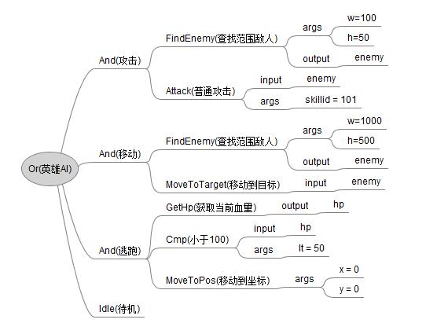

# 另类的行为树设计方案
机缘巧合，近几年的工作一直有涉及到游戏AI这块，网上常见的行为树+黑板似乎不太能满足复杂策划需求，也不太可能让策划自己去配置这种行为树。因此，我对行为树的黑板进行了小改造，让行为树更像一个代码编辑器，我们程序提供为数不多的行为节点，让策划通过编辑行为树来实现他们想要的逻辑，这对于游戏程序员来说也算是一种解放吧。

之前写过好多种语言的版本，我重新写了一份精简的lua版，只是为了展示用，不考虑性能问题。

## 基本概念
### 节点数据结构
```
{
    name = 'find_enemy',        -- 节点名称
    desc = '查找敌人'，          -- 说明
    args = {w = 100, h = 50},   -- 常量配置
    input = {'var1', 'var2'},   -- 输入变量
    output = {'target'},        -- 输出变量
    children = {}               -- 子节点
}
```
### 常量
通常是固定值，比如范围，类型之类的
### 输入/输出变量
因为节点之间都有相互的影响，比如这个节点可能会用到上一个节点所产生的数据，所以大多数行为树设计者都提供一个数据结构来记录行为树的运行状态，称之为“黑板”。

我偷换了个概念，把节点当成一个function来执行，如上面一个节点定义的input={'var1', 'var2'}意思是在执行节点前从黑板从把var1和var2这两个变量取出来，作为参数传进去，在节点执行完后把结果返回，并写到target这个变量上。整个过程就像下面这段伪代码：
```
function find_enemy(var1, var2)
    local w, h = args.w, args.h
    // do find enemy in range w, h
    ...
    return target
end
```
上面这个节点执行完，黑板上target这个变量就写上了查找到的目标，而后面的节点就可以使用target这个变量作为input了。
```
{
    name = 'attack',
    desc = '攻击敌人',
    args = {skill = 101},
    input = {'target'},
}
```

## 常用节点
常规的行为树做法是节点分成修饰节点和行为节点两大类。我为了更灵活的设计节点，特意混淆了这两个概念。所有的节点都可以返回true或false，所有的节点都可以有行为逻辑。下面我列举我比较常用的一些节点
+ Parallel
并行执行, 执行所有子节点并反回true
+ And
且，执行所有子节点直到返回false(等同于Sequence顺序执行，我为了好理解叫And)
+ Or
或，执行所有子节点直到返回true(等同于Selector 选择执行)
+ Not
取反

## 特殊节点
+ Wait 等待N帧后之后继续执行行为树
+ WaitUntil 一直等待，直到子节点返回true，可以让行为树一起卡在一个节点上，比如从A移动到B，WaitUntil的子节点就是判断与B的距离是否小于一定范围
+ Flow 执行流，由多个包含WaitUntil的子节点组成，可完成一系列动作，如从A移动到B再发起攻击

## 编辑器
+ N年前用Unity扩展写过一个行为树编辑器，功能比较强大，还能调试。这个代码就不开源了，因为unity版本太低，跟项目耦合太多，没法单独使用。我还写过一篇类似文档的东西，可以参考一下。[Moba游戏AI设计文档](Moba.md)


+ 专门写编辑器成本太高，我现在使用Freemind这款思维导图软件作为我们的编辑器，按照约定的格式画好，保存成xml格式，再转换成项目使用的格式。



导出lua格式:
```
return {
  name = [[Or]],
  desc = [[英雄AI]],
  children = {
    {
      name = [[And]],
      desc = [[攻击]],
      children = {
        {
          name = [[FindEnemy]],
          desc = [[查找范围敌人]],
          args = {w=100,h=50,},
          output = {"enemy",},
        },
        {
          name = [[Attack]],
          desc = [[普通攻击]],
          input = {"enemy",},
          args = {skillid = 101,},
        },
      },
    },
    ...
```

## 运行测试用例
+ 导出行为树
```
lua export.lua tree/hero.mm data/hero.lua
```
+ 运行测试

## TODO
计划使用antd来为这套方案做一个网页版的行为树编辑器，准备做的通用点，导出json等格式，带调试功能，不过我前端渣渣，不知道能不能捣鼓出来。ps:最近antd-pro出了个思维导图插件，感觉能用的上。。。

## About
这套方案我已经在好几个项目中使用过，动作，卡牌，MOBA，MMO类都有，教会策划，快活一年。这仅仅是一种思路，各位路过的大神，有啥建议或看法，欢迎提Issue。
